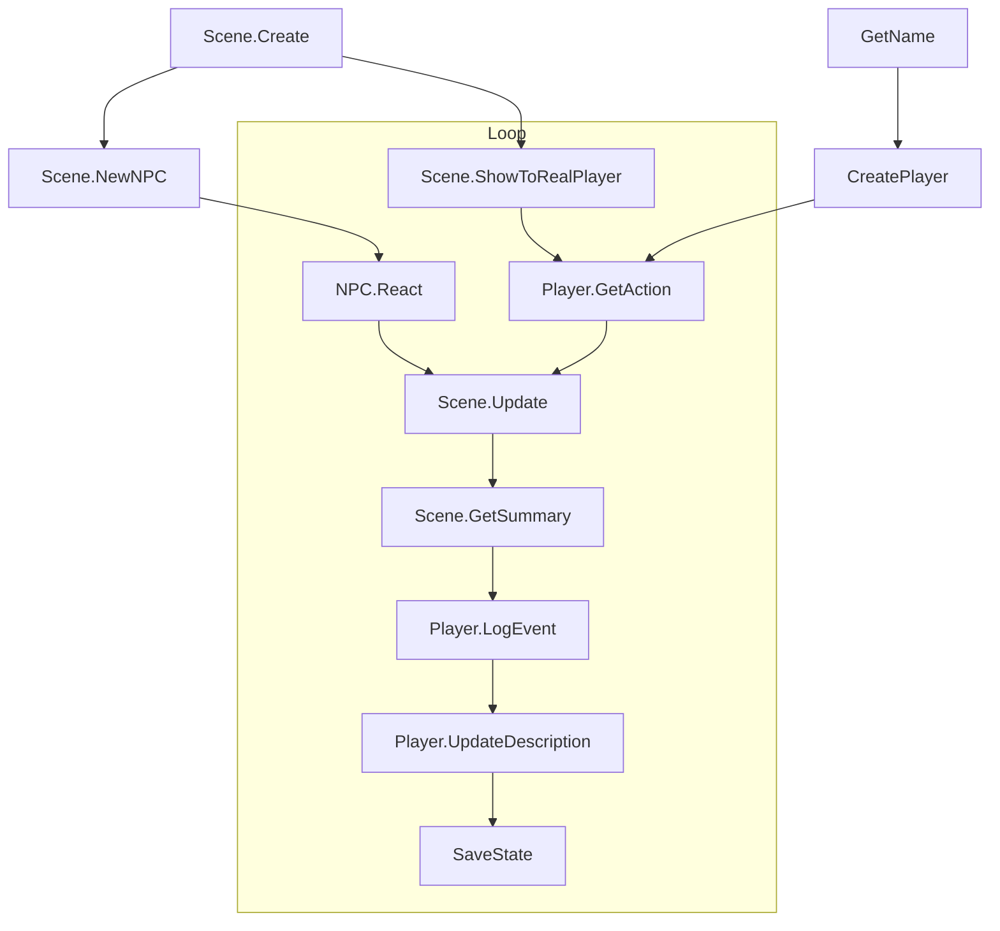

```mermaid  
flowchart TD

Scene.Create --> Scene.NewNPC
GetName --> CreatePlayer

subgraph Loop
    NPC.React
    Scene.ShowToRealPlayer
    Player.GetAction
    Scene.Update --> Scene.GetSummary
    NPC.React --> Scene.Update
    Scene.ShowToRealPlayer --> Player.GetAction
    Player.GetAction --> Scene.Update
    Scene.GetSummary --> Player.LogEvent
    Player.LogEvent --> Player.UpdateDescription
    Player.UpdateDescription --> SaveState

end

Scene.Create --> Scene.ShowToRealPlayer
Scene.NewNPC --> NPC.React
CreatePlayer --> Player.GetAction
```