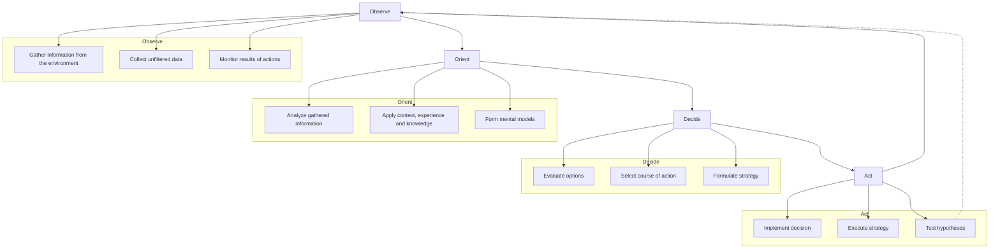

```mermaid  
flowchart TD
    A[Observe] --> B[Orient]
    B --> C[Decide]
    C --> D[Act]
    D --> A
    
    subgraph "Observe"
    A1[Gather information from the environment]
    A2[Collect unfiltered data]
    A3[Monitor results of actions]
    end
    
    subgraph "Orient"
    B1[Analyze gathered information]
    B2[Apply context, experience and knowledge]
    B3[Form mental models]
    end
    
    subgraph "Decide"
    C1[Evaluate options]
    C2[Select course of action]
    C3[Formulate strategy]
    end
    
    subgraph "Act"
    D1[Implement decision]
    D2[Execute strategy]
    D3[Test hypotheses]
    end
    
    A --> A1
    A --> A2
    A --> A3
    
    B --> B1
    B --> B2
    B --> B3
    
    C --> C1
    C --> C2
    C --> C3
    
    D --> D1
    D --> D2
    D --> D3
    
    D3 -.-> A

```