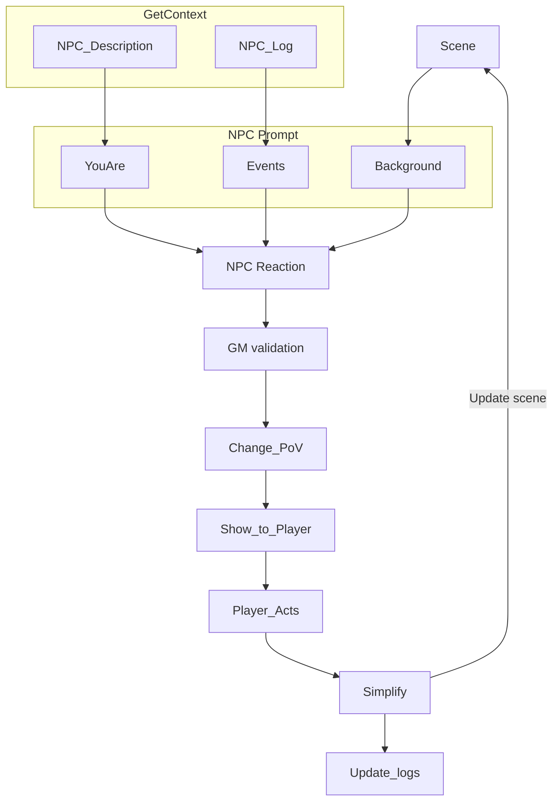

```mermaid  
flowchart TD

Observe["Scene"]
subgraph Orient["GetContext"]
    NPC_Description
    NPC_Log
end

subgraph Decide["NPC Prompt"]
    YouAre
    Background
    Events
end

Reaction["NPC Reaction"]

Observe --> Background
NPC_Description --> YouAre
NPC_Log --> Events

YouAre --> Reaction
Background --> Reaction
Events --> Reaction

Reaction --> Validate["GM validation"]
Validate --> Change_PoV
Change_PoV --> Show_to_Player
Show_to_Player --> Player_Acts
Player_Acts --> Simplify
Simplify --Update scene-->Observe
Simplify --> Update_logs

```