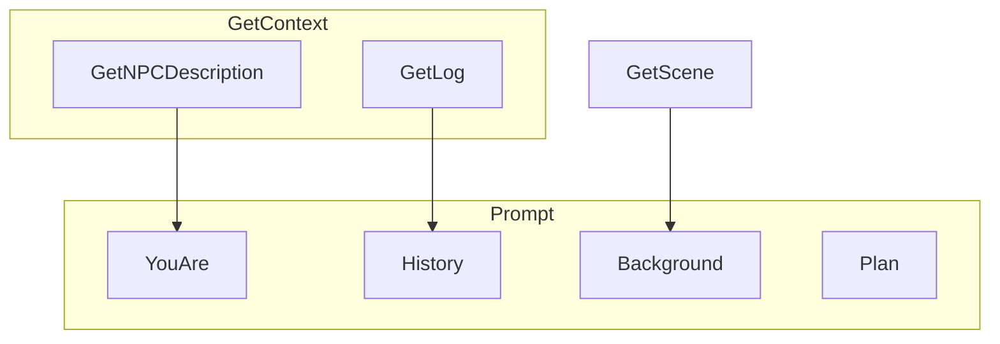

```mermaid  
flowchart TD

Observe["GetScene"]
subgraph Orient["GetContext"]
    GetNPCDescription
    GetLog
end

subgraph Decide["Prompt"]
    YouAre
    Background
    History
    Plan
end

Observe --> Background
GetNPCDescription --> YouAre
GetLog --> History

```